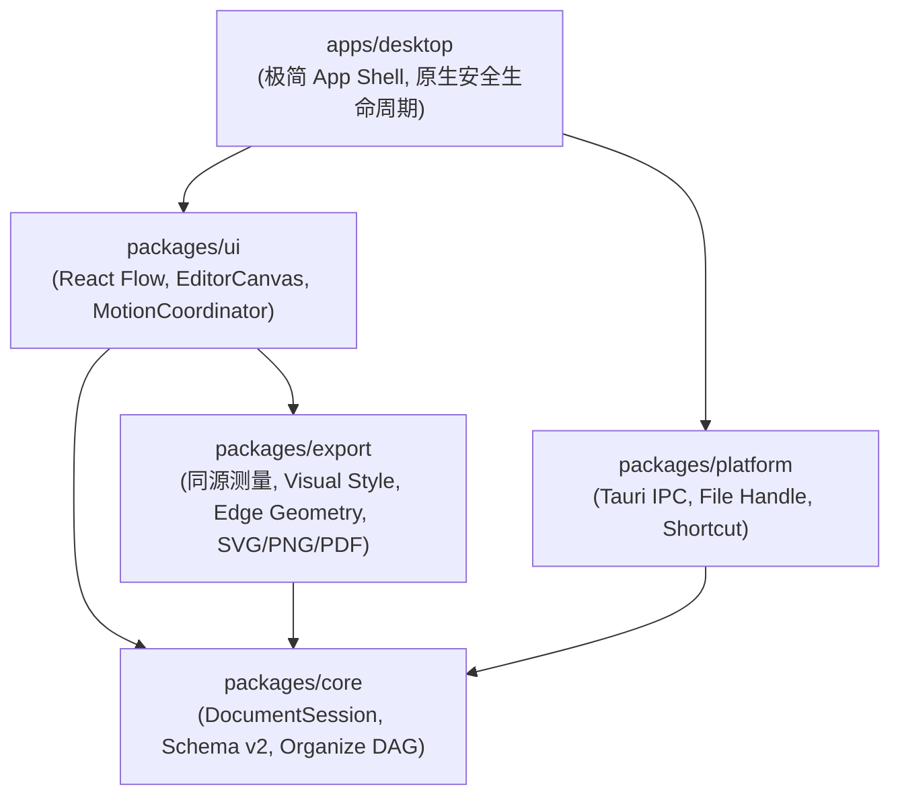

# 视觉、动效与导出架构说明（VRA 批次采纳）

## 1. 架构拓扑与模块职责

本架构已于 2026-09-06（VRA-000～VRA-090 批次）全面落地并验证，确立了领域、绘制、交互与桌面外壳的四层单向依赖关系：

### 1.1 `@mindmap/core`（纯领域层）
- **边界**：零依赖（无 React、无 React Flow、无 DOM、无 Tauri、无 Node builtins）。
- **Schema v2**：支持节点眉题（`kicker`）、节点色彩角色（`emphasis`）、边线型（`lineStyle: solid | dashed | dotted`）。严格兼容 v1 文件的读取与自然升级。
- **布局引擎 (`organize.ts`)**：全图 Kahn 拓扑分层，支持汇聚与多父节点，保留跨层长边；横向（默认）与纵向布局；终态严格有限坐标且无矩形重叠；幂等性（二次整理 0 moves）。

### 1.2 `@mindmap/export`（共享绘制契约与导出）
- **同源事实源**：UI 画布与 SVG/PNG/PDF 导出唯一消费的视觉常数（`visual-style.ts`），暖白（`#F9F8F4`）与黑板（`#16140F`）双主题。
- **共享边几何 (`edge-geometry.ts`)**：一处计算连接锚点、控制点通道、实心箭头与正交电路线形态。支持路线拓扑冻结与形态参数 $m \in [0, 1]$ 连续插值。
- **三格式导出**：
  - SVG：语义化 `<text>`/`<tspan>`，无 `foreignObject`，内嵌字体。
  - PNG：基于 resvg-wasm 渲染，严格 2× 物理像素。
  - PDF：基于 pdf-lib 矢量绘制，支持 Noto Sans SC 与 LXGW WenKai。

### 1.3 `@mindmap/ui`（视觉呈现与动效协调）
- **画布操作面**：实心卡片、富文本行排版、眉题弱化辅助、选中/焦点高对比光环、连接手柄与快捷操作条。
- **动效协调器 (`MotionCoordinator`)**：
  - 单一 rAF 时钟，统一驱动全图节点显示坐标与连线形态 $m$。
  - 800ms 标准时间线：三次缓动曲线 `cubic-bezier(0.22, 0.61, 0.36, 1)`。
  - 错峰策略：叶子节点优先启动，主干归位收束，最大错峰延迟 120ms。
  - 状态保全：整理立即提交一条 `MoveNodes` 历史；动画期间仅更新显示态；单节点拖拽打断平稳；`prefers-reduced-motion` 0ms 立即完成；$\ge 300$ 节点自动取消错峰。

### 1.4 `apps/desktop`（极简 App Shell 与原生外壳）
- **AppHeader**：40px 高度轻量顶栏，集成左侧文件菜单、居中保存状态与标题、右侧整理主按钮与视图菜单，不破坏全屏沉浸感。
- **AppNotice**：非侵入式悬浮提示（Toast 自动关闭 / Banner 错误常驻），绝对定位于画布上方，绝对不改变画布尺寸与节点世界坐标系。
- **原生生命周期集成**：严格绑定 Rust host 凭据、保存队列、未保存关闭三分支对话框与启动恢复链路。

---

## 2. 自动化质量防线

质量验证以根 `package.json` 的唯一入口 `run-all.mjs` 为核心：
- `test:unit`：37 个测试文件，381 项单元与契约测试。
- `test:visual`（`run-visual-alignment.mjs`）：6 层真实验收体系（1080×864 静态外观、自动整理、800ms 关键帧、三格式真实样本、富文本编辑、300/450 规模基线）。
- `test:export`：14 项 export golden 回归测试。
- `test:a11y`：axe-core 无障碍规范扫描。
- `boundaries`：模块单向依赖与画布隔离边界审查。
